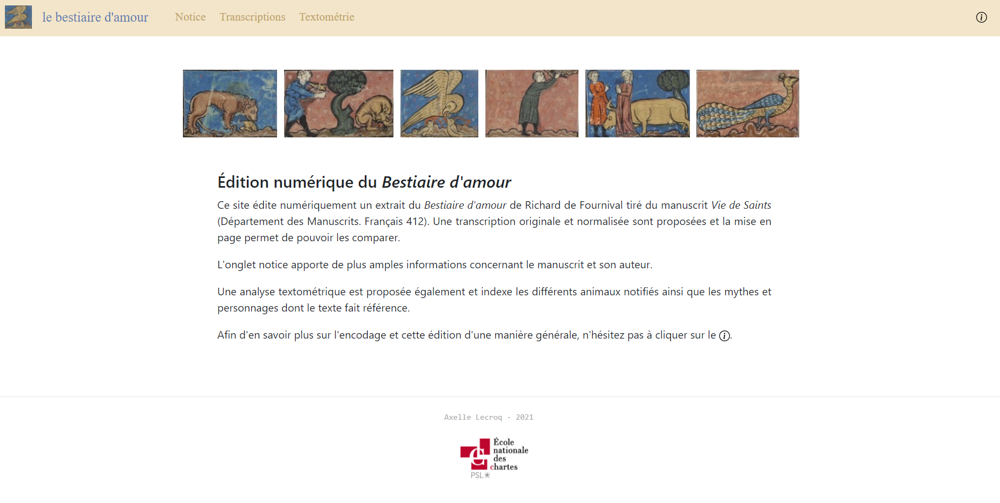

> Lisez ces informations en français, [ici](README_french.md)
## Digital edition
This project is an digital edition in TEI-XML of an extract of *Le bestiaire d'amour* by Richard de Fournival (BnF, ff.232v, 233r and 233v), written in Old French. The manuscript is kept at the Bibliothèque nationale de France in the Department of Manuscripts and is available in [digital form](https://gallica.bnf.fr/ark:/12148/btv1b84259980). This digital edition was produced as part of the TEI-XML and XSLT courses of the "Technologies appliquées à l'histoire" Master's course given at the École nationale des chartes and was developp by [Axelle Lecroq](https://github.com/axellelecroq) during the year 2021.


[]()

## Steps of the project
1. Text transcription from Old French to modernized french
2. Encoding in TEI-XML:
    - text structuring
    - encoding of metadata
    - encoding of abbreviations and graphic normalisations in order to preserve the original spelling and to propose a standardised spelling
    - indexes of names of characters, animals and events mentioned
3. ODD's creation according to the RelaxNG scheme
4. Writing a HTML documentation to present the encoding choices and the various ways in which the project could be exploited.
5. XML to HTML with XSLT

## Repository structure
```
digital-edition-bestiaire
            ├── documentation
            │       ├── le-bestiaire_odd.html
            │       ├── le-bestiaire_odd.rng
            │       └── le-bestiaire_odd.xml
            ├── img/...
            ├── templates
            │       ├── accueil.html
            │       ├── apropos.html
            │       ├── index-event.html
            │       ├── index-personnage.html
            │       ├── index.html
            │       ├── notice.html
            │       └── transcription.ipynb
            ├── .gitignore
            ├── README.md
            ├── README_french.md
            ├── le-bestiaire.xml
            └── le-bestiaire.xsl
```